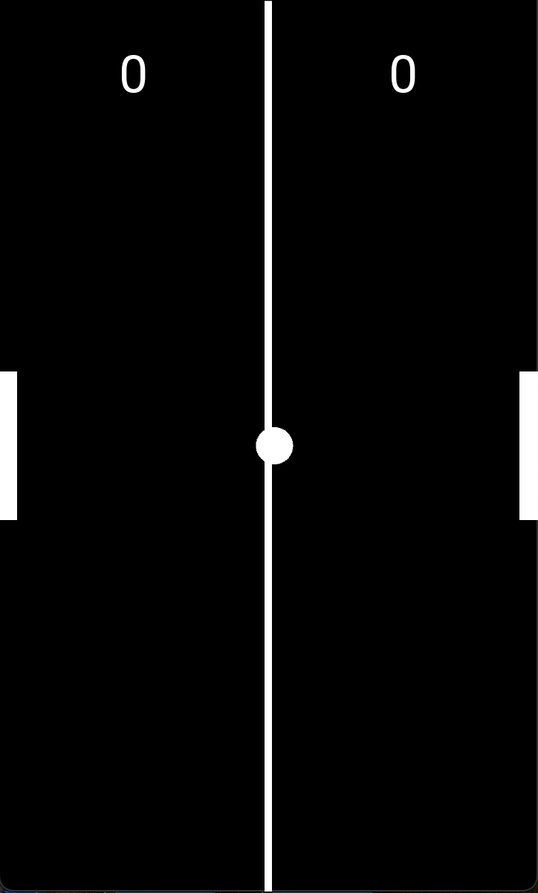
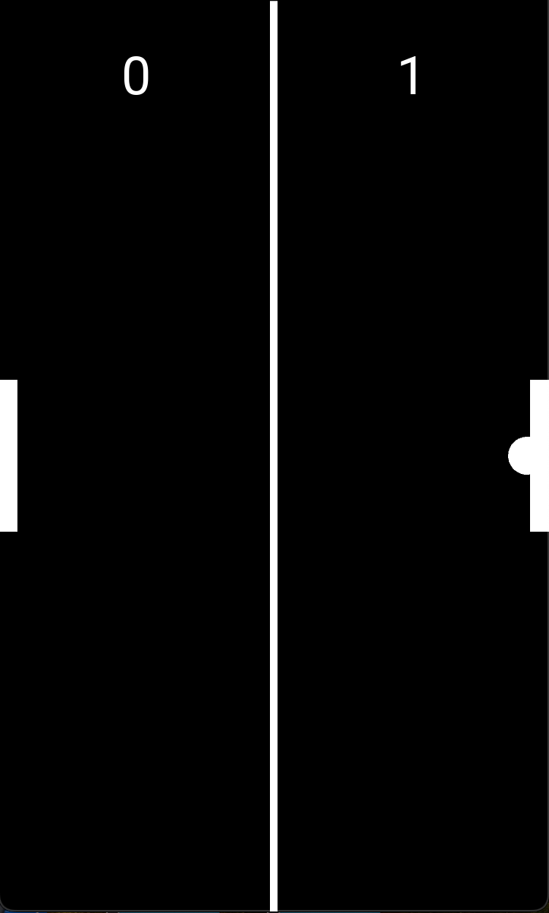
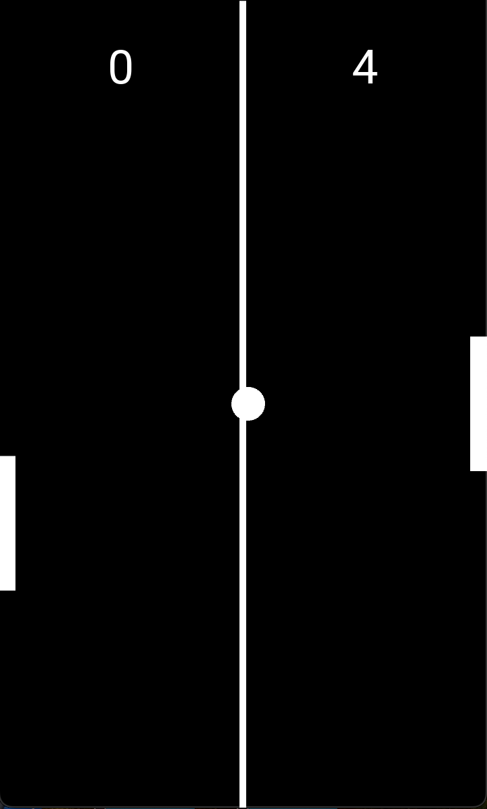

# 🏓 Kivy Pong Game

シンプルな Pong（卓球）ゲームを Kivy で実装したデモアプリです。  
`main.py` と `pong.kv` の２ファイルで構成されています。

## スクリーンショット

| サーブ                      | バウンド                       | スコア                      |
| --------------------------- | ------------------------------ | --------------------------- |
|  |  |  |

## 主な機能

- **自動生成したボール** が左右に反射
- **パドルとのバウンド**：当たるたびに速度が少し増加
- **壁バウンド**：上下の壁で反射
- **スコアリング**：画面外へ出ると相手に得点
- **60FPS 更新**：`Clock.schedule_interval` で滑らかな動き

## 環境セットアップ（macOS + uv）

### 1. `uv` インストール（初回のみ）

```bash
pip install uv
```

### 2. 仮想環境の作成と依存ライブラリのインストール

```bash
make setup
```

## アプリ実行（macOS）

```bash
make run
```

- ウィンドウが開いたら、自動的にボールが飛び出します。
- 1P（左パドル）は画面左端のドラッグ、
- 2P（右パドル）は画面右端のドラッグで操作できます。

## iOSアプリのビルド手順

> macOS + Xcode が必要です（Apple IDで無料ビルド可）

### 1. iOSビルド用ツールのインストール

```bash
pip install cython
pip install kivy-ios
```

### 2. iOSプロジェクト作成〜アプリビルド

```bash
make ios
```

* `main.py` をもとに `pong-ios/` フォルダが自動生成され、必要ライブラリをビルドします。

### 3. iOSシミュレータで起動 or 実機用に Xcode を開く

```bash
make ios-open
```

## Makefile コマンド一覧

| コマンド        | 内容                                              |
| --------------- | ------------------------------------------------- |
| `make setup`    | 仮想環境と依存ライブラリのインストール（macOS用） |
| `make run`      | macOS上でアプリを起動                             |
| `make ios`      | iOS向けにプロジェクトを生成してビルド（自動化済） |
| `make ios-open` | Xcodeで開いて署名・実機ビルドを行う               |

## 注意事項

* iOS用ライブラリは `sh/build_ios.sh` に明示的に指定されています（pipではなくtoolchainでビルドされます）
* `uv` は macOS開発用、iOSビルドは system Python（またはvenv外）で行います
* `pong-ios/` は自動生成されるため Git 管理しません
